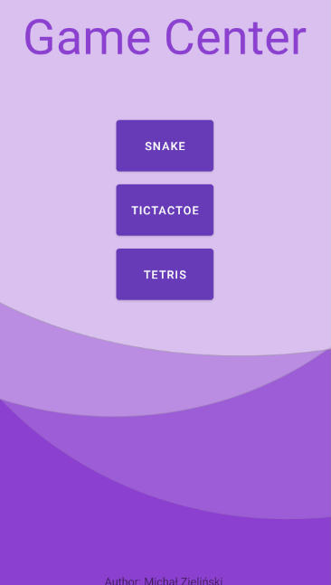
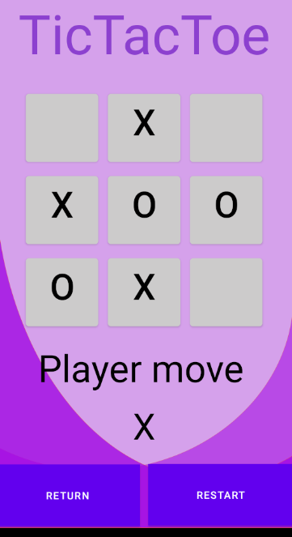

# GameCenter  
Simple App with mobile games

## Table of content  
[What did I do and what will be done...](#what)  
[TicTacToe](#tictac)
[Snake](#snake)  
[Tetris](#tetris)

## What did I do and what will be done...   
#### What did I do:
1. Created TicTacToe Game with JetBrains Academy course  
2. Learned more Kotlin with Big Ner Ranch book Programming in Kotlin - created NyetHack repository  
3. Created first layout for my App  
4. Implemented TicTacToe Game on mobile  
5. Improved layouts' responsiveness and their look  
6. Started implementing Snake  

#### What will be done:  
1. Finish Snake  
2. Make Tetris game  

## TicTacToe   

## Snake 

In progress...

## Tetris 

In progress...